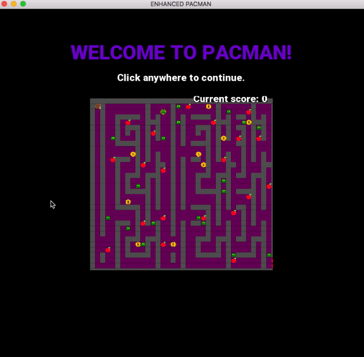

# README
NOTE: READ THE ERRATUM SECTION. DON'T USE MY CODE AS A REFERENCE FOR "PERFECT" STYLE.

 * Overview 
 * Requirements
 * Installation
 * Citations 
 * Erratum 

## Overview 
I created a version of Pacman that takes a photo of the user and replaces the pacman avatar with the user's face. This verson of Pacman also has a default version, where the pacman is just the default yellow pacman.

## Requirements
* OpenFrameworks version 9.8 or higher. Notice that older versions of OpenFrameworks aren't guaranteed to work, as some versions appear to be quite different. To install OpenFrameworks, follow the instructions at http://openframeworks.cc/download/ 

You will also need to add ofxGui and ofxOpenCv to the project using OpenFrameworks. To do so, open OpenFrameworks' projectGenerator app (path/to/of/download/projectGenerator-osx or a similar path if you're installing this on another OS), import this project, and select ofxGui and ofxOpenCv under the drop-down menu in the Addons section.

## Installation
Installation is quite straightforward.
Steps:
1. git clone https://github.com/uiuc-sp18-cs126/final-project-ElizWang
2. Open in Xcode or a similar IDE through OpenFramework's projectGenerator app.
3. Run.

## Code Style
I wrote this code in accordance with the Google C++ Style Guide (https://google.github.io/styleguide/cppguide.html). Note that methods required by OpenFrameworks deviate from this style.

## Demo
Below is a full demo of the photo-taking version of the Pacman. Notice that the user can change his or her setting selection; only the final selected settings go into setting up the game.

  

## Citations
I began by modifying the code from of-snake (https://github.com/uiuc-sp18-cs126/of-snake-ElizWang), which was not written by me. However, I only used of-snake as a starting point and added enough code to completely distinguish my projecft from of-snake.

I used OpenCv's facial detection haar cascade in detecting faces from photos taken (https://github.com/opencv/opencv/blob/master/data/haarcascades/haarcascade_frontalface_alt.xml). This was cloned and added to bin/data/haar_cascades.

I also used ofxCenteredTrueTypeFont (https://github.com/armadillu/ofxCenteredTrueTypeFont) to format the game instructions. I cloned this and added it in src/header_addons. 

Below are the citations to the images I used. Note that all images (except for the user headshots) were taken from google.
* Default pacman - https://findicons.com/search/pacman
* Food (fruit) - https://www.flaticon.com/free-icons/apple-fruit
* Ghost - http://iconbug.com/detail/icon/2508/floating-ghost/
* Coin - http://clipart-library.com/a-coin-cliparts.html

## Erratum 
Disclaimer: I wrote this when I was a freshman. DO NOT use my code as a reference for perfect style. If you have any questions, email me.

Stuff I should've done:
1. All commit messages should start with an upper case letter
2. Public blocks (in header files) should be before private blocks, not after. This is because other users care about the public interface rather than the private implementation.
3. I should've used namespaces for all util methods/enums (ex: direction.h)
4. Should've added formal "javadoc" style documentation in all header files. Too many line comments clutter up code and make it harder to read, not easier. 
5. Should've drastically cut down on the # of line comments
6. Should have used for each whenever possible

I'll update this section if I find anything else noteworthy. 
